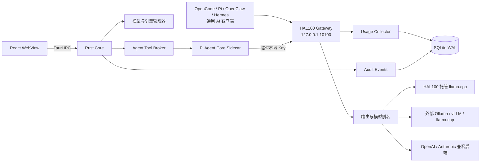

<p align="center">
  
</p>

<h1 align="center">HAL100</h1>

<p align="center">
  面向本地 AI 的桌面控制中心：统一管理模型、推理服务、软件接入、受控 Agent 与精确 Usage。
</p>

<p align="center">
  
  
  
  
</p>

HAL100 不是通用聊天客户端，也不是另一个 Coding Agent。它是运行在用户电脑上的本地 AI 控制平面：负责下载和管理 GGUF 模型、托管或连接推理服务，通过统一 Gateway 为 OpenCode、Pi Coding Agent、OpenClaw、Hermes Agent 等软件提供模型，并按客户端记录推理后端返回的精确 Token 用量。

内置 HAL100 Agent 使用本地小模型与 [Pi Agent Core](https://github.com/earendil-works/pi) 帮助用户诊断、部署、配置和调试 HAL100 环境。Pi Agent Core 只负责任务与工具调用编排；模型请求统一经过 Gateway，Rust Core 始终是唯一授权与执行权威。

> [!WARNING]
> HAL100 当前版本为 `1.0.6` 开发初期版本，主要用于Apple Silicon Mac内部开发测试。当前开发范围明确不包含签名、公证、安装包、自动更新、正式升级或正式发布流程；这些事项也不作为当前缺陷或默认下一阶段任务。项目不支持Intel Mac；Windows 10/11与Linux已建立源码编译和宿主探针基线，但完整桌面与引擎纵向尚未逐格验收，不能视为正式平台支持。

## 当前开发版

`1.0.6` 已完成迭代0—59，当前推进迭代60多引擎验收收口。运行方案已升级为schema v15/spec v3，绑定精确适配器、后端配置修订、origin指纹、协议能力指纹、类型化模型证据及“平台 × 架构 × 加速器 × 部署”支持格；切换由持久化journal保护，启动时只补偿到旧安全状态。外部引擎检查使用Rust验证目标和Keychain认证，禁代理/重定向并支持多个实例。Windows/Linux宿主探针与目标编译基线已建立；vLLM固定版本/健康/模型检查及Chat、SSE、Usage、工具资格探针已接入，但真实Linux/CUDA验收前仍保持`connected`。MLX-LM官方回环服务已在Apple M1/Metal上完成真实模型资格与运行方案激活闭环，支持单元为`verifiedExternal`。MLC LLM官方OpenAI回环适配器已接入，正式资格使用Rust有界的本地部署内容指纹而不依赖官方空`system_fingerprint`；固定Qwen3.5-2B候选已通过单次目录、工具、普通流式、Usage和Gateway形态，但官方0.20调度器在工具请求后的后续请求中可复现rollback崩溃，0.26 nightly又存在编译/运行包漂移，因此没有稳定性证据并继续保持`connected`。OpenVINO Model Server（OVMS）已接入KServe元数据/健康、OpenAI模型目录与共同协议资格适配器，并拆分为CPU、Intel GPU、Intel NPU三个单设备变体；平台真机和Intel设备插件证据完成前保持`connected`。SGLang官方OpenAI Server适配器已接入版本、健康、模型目录和共同协议资格检查；Linux/CUDA真机证据完成前保持`connected`。LMDeploy官方`api_server`适配器已接入健康、模型目录和共同协议资格检查；由于官方服务没有稳定机器可读版本端点，Linux/Windows CUDA真机身份证据完成前保持`connected`。TensorRT-LLM官方`trtllm-serve`适配器已接入版本、健康、模型目录和共同协议资格检查；Linux NVIDIA真机、GPU/后端/模型形态与运行方案证据完成前保持`connected`。迭代60能力目录现额外展示官方合同、协议资格、平台真机、引擎身份、模型部署身份、方案闭环和稳定性七类证据进度，版本化支持矩阵位于[`contracts/inference-engines/v1-support-matrix.json`](contracts/inference-engines/v1-support-matrix.json)。Agent RPC已升级到v13，包含20类任务和20个固定工具；运行方案启用也进入Rust一次性计划、原生确认和现实复验链路。复合任务图、16K/32K设备档、有界澄清、脱敏检查点和用量统计保持可运行；64K因缺少最低设备实测继续关闭。易变实现事实以[当前开发状态](docs/CURRENT_STATE.md)为准。

迭代51—60按[推理引擎正式支持计划](docs/INFERENCE_ENGINE_SUPPORT_PLAN.md)持续实施；能力目录现在
由Rust给出基于设备与正式支持状态的可解释排序，预留或仅连通
引擎不会因为代码接入或进入路线图就提前显示为正式可用。

1.0.6 同步纳入 UX-1—UX-5 用户目标导向界面重构，包括五入口信息架构、按需技术详情、受控
Agent 任务流程、响应式布局，以及用量页的 Token 折线趋势和年度请求活动方格。

迭代60当前使用v2版本化验收证据账本：[`contracts/inference-engines/v2-acceptance-evidence.json`](contracts/inference-engines/v2-acceptance-evidence.json)，其结构合同位于[`v2-acceptance-evidence.schema.json`](contracts/inference-engines/v2-acceptance-evidence.schema.json)。真实平台验收记录导入并通过Rust晋级门禁前，支持等级保持保守；验收产物会绑定已验证服务实例的实例 ID、origin 指纹、配置修订、结构化协议能力哈希，以及原生宿主探针修订和隐私安全的设备类别SHA-256，防止跨实例、协议或支持格重放。v1账本保留为只读历史；既有Ollama两格与MLX-LM一格在v2中明确标记为`legacyHostSummaryV1`，不会伪造回填设备指纹，新导入和重新资格验证只接受`nativeHostProbeV1`。

被忽略的真实验收测试会先通过三平台原生 `NativeSystemProbe` 校验实际平台、架构与加速器，
不接受合成硬件快照。多支持格入口必须显式选择加速器：Ollama 使用
`HAL100_OLLAMA_ACCELERATOR=cpu|metal`（Metal 仅限 Apple Silicon，Linux/Windows 当前只声明
x86_64 CPU 格），OpenVINO 使用 `HAL100_OPENVINO_ACCELERATOR=cpu|intel_gpu|intel_npu`；选择值仍须命中当前
适配器 manifest 与原生宿主探针，不能用环境变量扩张支持范围。
八个外部引擎验收测试统一使用同一个 manifest 驱动的本地支持格选择器；仓库回归会检查当前全部
28 个外部支持格都有可执行入口，并拒绝未知或未声明的平台、架构、加速器组合。该门禁不探测服务，
也不替代目标主机上的真实模型、加速器、稳定性和运行方案证据。
同一组非 ignored 回归还以纯结构夹具逐格证明：完整运行产物能够经过人工模型修订、原子账本追加、
canonical 协议能力哈希复核和审查注册表投影，使候选严格覆盖报告达到 29/29；夹具账本只存在于
测试内存中，不会写入正式账本或冒充真机验收。
通过后，测试支持显式生成脱敏运行产物：设置 `HAL100_ACCEPTANCE_EVIDENCE_EMIT=1` 可输出
JSON，或同时设置 `HAL100_ACCEPTANCE_EVIDENCE_WRITE=1` 和明确的
`HAL100_ACCEPTANCE_EVIDENCE_OUT` 可创建一个不覆盖旧文件的产物；详见
[`contracts/inference-engines/v2-acceptance-run.schema.json`](contracts/inference-engines/v2-acceptance-run.schema.json)。
运行产物只是待审查材料，不会自动提升任何引擎支持等级；八个 live acceptance 入口还会共享
20 次、每波最多 4 并发的有界稳定性探针，并把成功计数、并发度和最大延迟以脱敏 `stability` 对象
写入产物。取消、切换失败和重启补偿仍需额外真实验收。
对没有稳定软件包版本端点的 MLC LLM 与 LMDeploy，不伪造版本。MLC LLM要求绝对本地部署目录并
有界哈希配置、权重清单、全部声明分片和tokenizer；LMDeploy在服务实际返回非空
`system_fingerprint`时才将其与模型标识绑定为部署指纹。运行方案使用“版本未暴露”标记表达这一
事实，不把标记当作版本或内容摘要。

八个真实验收入口也可通过统一的白名单脚本执行。服务、模型和对应的版本/部署指纹必须由操作者
提前准备，脚本只运行指定的 ignored acceptance，不启动或安装任何引擎：

```bash
HAL100_RUN_REAL_ACCEPTANCE=1 \
  scripts/run-engine-live-acceptance.sh vllm
```

Windows 主机可使用等价的 PowerShell 入口（需要已安装 Rust/Cargo）：

```powershell
$env:HAL100_RUN_REAL_ACCEPTANCE = "1"
.\scripts\run-engine-live-acceptance.ps1 vllm
```

可选引擎参数为 `ollama`、`mlx-lm`、`mlc-llm`、`openvino`、`vllm`、`sglang`、`lmdeploy` 和
`tensorrt-llm`；脚本会将产物写入 `output/inference-acceptance/`，并使用 create-new 语义避免
覆盖已有记录。脚本不会自动导入账本，导入前仍需人工复核模型不可变修订。

仓库另提供仅 `workflow_dispatch` 可触发的
`.github/workflows/live-engine-acceptance.yml`。它只调度带 `hal100-acceptance` 标签的隔离自托管
macOS ARM64、Linux x64/ARM64 或 Windows x64 主机，连接操作者已准备的回环服务，并把 create-new
脱敏 JSON 作为短期 artifact 上传。工作流不会安装、下载、启动或重配置引擎，也不会自动导入账本
或改变支持状态。手动触发参数只包含引擎、平台和加速器；API root、模型ID/本地路径、审查版本及
可选vLLM密钥必须放在对应精确支持格的受保护GitHub Environment secrets中，避免进入触发事件和
运行标题。一个无秘密的普通Ubuntu验证任务会先用版本化支持矩阵把三个选择解析为唯一适配器和
支持格；矩阵外组合不会调度自托管主机。通过后，Rust原生preflight仍会在任何服务请求前重新证明
实际平台、架构和加速器。
当前需要准备的精确runner/Environment清单可由
`node scripts/list-engine-acceptance-targets.mjs`只读生成，隔离、secret和人工审查要求见
[推理引擎真机验收runner手册](docs/INFERENCE_ENGINE_ACCEPTANCE_RUNNERS.md)。

真实运行产物不能直接晋级。人工复核模型修订后，可用 Infra 的导入工具生成一个新的账本文件（原
账本不会被覆盖），并在输出前再次校验所有标准适配器与精确支持格：

```bash
cargo run -p hal100-infra --bin hal100-engine-acceptance-import -- \
  --run ./acceptance-run.json \
  --ledger ./contracts/inference-engines/v2-acceptance-evidence.json \
  --output ./acceptance-evidence.reviewed.json \
  --model-revision 'Qwen3-8B@immutable-revision'
```

该命令只接受通过七类证据门禁的 `passed` 产物、显式的非脱敏模型修订和
`verifiedExternal` 状态；输出路径必须是新文件。审查结果确认无误后，再由维护者将新文件作为
代码变更提交，桌面端才会在内存中晋级对应支持格。证据来源必须是仓库相对的允许前缀，路径穿越、
URL 和绝对路径会被拒绝。

在准备验收或审查账本前，可以运行只读覆盖报告查看每个适配器的支持格、有效状态和待补证据：

```bash
cargo run -p hal100-infra --bin hal100-engine-support-report -- --json
```

传入 `--ledger REVIEWED_LEDGER.json` 可检查候选账本；`--strict` 会在仍有非正式支持格或正式格
缺少账本记录时以非零状态退出。该报告只读，不连接、启动、安装或激活任何引擎，也不替代真实
三平台验收和人工审查。

| 入口 | 当前职责 |
| --- | --- |
| 首页 | 根据模型与运行时的真实状态，显示一个优先事项和推荐下一步 |
| 模型与运行 | 管理模型、HAL100 托管运行时、外部推理服务与模型测试 |
| 软件接入 | 检测、配置和断开 OpenCode、Pi、OpenClaw、Hermes 及通用客户端 |
| Agent | 诊断环境、检查部署状态并生成由 Rust 执行的受控操作计划 |
| 活动 | 分别查看精确 Token 用量和最近 50 条受控操作记录 |
| 运行方案 | 保存、复验并快速切换多个本机模型与推理引擎组合 |
| 设置 | 管理下载来源、启动行为、外观、本机数据保留策略与版本信息 |

用量页以同一时间范围和筛选条件驱动摘要、客户端分布、趋势、Token 构成与明细；支持年、月、周、天四档，折线分别显示输入（缓存命中）、输入（缓存未命中）与输出，全年活动图固定展示过去 365 天并可联动单日数据。

## 主要能力

| 能力 | 当前实现 |
| --- | --- |
| 模型管理 | 从 Hugging Face 或 ModelScope 搜索公开 GGUF，支持断点下载、哈希与 GGUF 校验、原子安装；本地 GGUF 可只读导入索引 |
| 推理服务 | 安装和管理固定、可校验的 Apple Silicon `llama.cpp`；只读识别本机Ollama、官方 MLX-LM 与 MLC LLM 回环服务；连接外部 Ollama、vLLM、llama.cpp Server 及 OpenAI/Anthropic 兼容后端 |
| 本地 Gateway | 固定回环入口，支持 OpenAI Chat Completions、OpenAI Responses、Anthropic Messages、SSE、Tool Calling 与取消 |
| 路由与切换 | `hal100-active` 活动模型、模型别名、安全排空切换、经原生确认的强制切换与故障关闭 |
| 软件接入 | 专门适配 OpenCode、Pi Coding Agent、OpenClaw 与 Hermes Agent；每个客户端拥有独立配置、凭据、Usage 身份和可逆断开流程，同时支持通用 OpenAI/Anthropic 客户端 |
| 用量统计 | 年/月/周/天统一范围；按客户端、模型、后端和状态筛选；独立统计缓存命中输入、缓存未命中输入和输出，并提供全年 365 天请求活动图 |
| 操作记录 | 界面加载最近 50 条受控操作，支持类型筛选、搜索和脱敏详情；历史数据继续按用户设置的本机保留策略管理 |
| HAL100 Agent | 本地 Qwen 默认运行；可由用户主动选择单次云端或当前内存会话，支持环境诊断、公开模型发现、部署观测，以及模型、引擎和外部 Agent 的受控计划 |
| 后台运行 | 系统托盘、隐藏并复用主 WebView、按需启动 Sidecar/模型运行时，空闲时不轮询模型、统计或审计数据 |

## HAL100 如何工作



所有客户端只需要连接 HAL100 Gateway。模型切换发生在 Gateway 后方，因此外部 Agent 不需要随模型变化反复修改地址；只要请求经过 HAL100，Token 就能按客户端准确归属。HAL100 内置 Pi Agent Core 与用户安装的官方 Pi Coding Agent 使用完全独立的进程、HOME、会话和凭据生命周期。

更完整的进程、模块和请求生命周期说明见[软件架构](docs/ARCHITECTURE.md)。

## HAL100 Agent

HAL100 Agent 只负责 HAL100、本地模型和推理环境，不作为通用聊天助手。

- 本地默认使用 Qwen3.5-2B Q4_K_M；云端模型只有在用户主动选择后才会使用。
- Agent Kernel 固定使用 Pi Agent Core / Pi AI 0.84.2，通过版本化私有 RPC 与 Rust 通信。
- Pi Sidecar 不持有云端 API Key，不直接连接推理后端，也不能执行任意 Shell、文件或进程操作。
- Agent 只能调用 HAL100 暴露的固定工具；Rust 会重新校验工具、参数、现实状态和请求关联。
- 安装、卸载、删除、配置写入和强制切换始终需要 Rust 发起的原生确认。
- Rust任务检查点会区分检查、规划、等待确认、执行、复验和终态，并显示有界证据结论；执行器或模型回答不能自行声明成功，应用重启不会恢复旧计划或确认权限。
- 当前 Agent 可诊断环境、读取脱敏运维历史、执行短时部署观测、读取 Rust 生成的脱敏引擎能力与支持格摘要、搜索公开模型目录，并生成模型下载、启动、切换、单项修复、外部 Agent 配置/断开以及 Pi 私有安装/卸载计划。
- 模型搜索最多返回有界公开目录元数据；下载必须命中同一任务的可信文件快照，仍由 Rust 复验并在原生确认后执行。
- Pi 私有安装固定官方归档与完整 npm 依赖闭包；私有卸载只处理 HAL100 所有的运行时并移入系统废纸篓，不触碰用户安装的 Pi、配置、凭据或会话。
- OpenCode、Pi Coding Agent、OpenClaw 与 Hermes Agent 均支持独立检测、配置预览、确认写入和精确断开；当前只有 Pi 提供 HAL100 受管安装配方。

详见[受控 Agent 架构决策](docs/adr/0004-controlled-agent.md)、[安全设计](docs/SECURITY.md)和[第三方 Agent 依赖登记](docs/THIRD_PARTY_AGENT_DEPENDENCIES.md)。

## 隐私与安全边界

- Gateway 默认只监听 `127.0.0.1`，不会自动暴露到局域网。
- API Key 保存在 macOS Keychain；SQLite、前端状态和日志只保留必要摘要。
- HAL100 默认不保存提示词和回答正文。
- 云端 Agent 在发送前展示脱敏范围；失败时不会静默回退到其他模型。
- 外部后端默认只连接和监测，HAL100 不假定拥有其进程或安装目录。
- 托管模型删除会移入系统废纸篓；外部模型默认只移除索引，不删除源文件。
- 浏览器预览模式不具备真实系统操作能力，所有变更入口保持禁用。

发现安全问题时，请不要在公开问题中提交凭据、完整日志、提示词、回答或本地路径。安全原则与报告要求见[安全设计](docs/SECURITY.md)。

## 平台状态

| 平台 | 状态 |
| --- | --- |
| macOS Apple Silicon | 当前唯一开发与测试平台 |
| macOS Intel | 不支持，未来也不计划支持 |
| Windows 10/11 | 源码构建与宿主能力探针基线已建立；完整桌面纵向和具体引擎支持仍需逐格验收 |
| Linux | 源码构建与宿主能力探针基线已建立；完整桌面纵向和具体引擎支持仍需逐格验收 |

首版界面仅提供中文，不区分“简单模式”和“高级模式”。

## 开发环境

### 前置要求

- Apple Silicon Mac
- Xcode Command Line Tools
- Node.js `24.18.0`
- pnpm `11.19.0`
- Rust `1.97.1`，目标 `aarch64-apple-darwin`

仓库通过 `.node-version`、`packageManager` 和 `rust-toolchain.toml` 固定工具版本。

### 启动桌面开发版

```bash
corepack enable
pnpm install --frozen-lockfile
pnpm desktop:open
```

`pnpm desktop:open` 会通过 Tauri 启动完整开发链路：先构建 Agent Kernel Sidecar，再启动 Vite 和桌面进程。不要直接执行 `target/debug/hal100-desktop`，该二进制在开发模式下依赖 Vite；如果误执行且前端服务不可用，HAL100 会显示原生诊断提示并退出，不再保留空白窗口。真实模型、Keychain、SQLite、Gateway、文件选择器与原生确认只在 Tauri 开发版中工作。

### 启动浏览器预览

```bash
pnpm dev
```

浏览器预览地址为 <http://127.0.0.1:1420>。该模式只提供明确标注的预览数据，不会安装引擎、下载模型、修改配置或执行 Agent 任务。

### 质量检查

```bash
pnpm check
```

完整检查包含：

- Biome 静态检查
- TypeScript 类型检查
- React 与 Sidecar 测试
- Rust 格式与 Clippy
- Rust Workspace 全量测试

常用的独立命令：

```bash
pnpm lint
pnpm typecheck
pnpm test
pnpm build
```

后台和规模验收脚本：

```bash
pnpm stability:quick
pnpm stability:matrix
pnpm stability:1h
```

这些脚本可能运行真实进程、占用测试端口或持续较长时间，执行前请阅读[内部测试说明](docs/INTERNAL_TESTING.md)。

## 项目结构

```text
HAL100/
├── apps/desktop/               Tauri 2 + React 中文桌面应用
│   ├── src/                    页面、组件和桌面 API 适配
│   └── src-tauri/              Rust 桌面壳与应用服务
├── crates/
│   ├── hal100-core/            领域状态与业务规则
│   ├── hal100-infra/           Gateway、SQLite、下载和运行时实现
│   ├── hal100-platform/        macOS/Windows/Linux 平台能力与宿主探针边界
│   └── hal100-protocol/        IPC、Gateway 与 Agent 协议类型
├── sidecars/agent-kernel/      Pi Agent Core 薄适配层
├── contracts/agent-rpc/        Agent 私有 RPC 契约
├── tests/stability/            稳定性、规模和恢复脚本
├── prototype/                  单文件交互界面原型
└── docs/                       产品、架构、安全、UI 与验收文档
```

## 性能基线

HAL100 的常驻核心与按需推理进程分离。窗口隐藏、无模型和无 Agent 任务时，不运行前端轮询或后台统计查询。

在 Apple M1、16 GiB 统一内存的 1 小时开发版观察中：

| 指标 | 结果 |
| --- | --- |
| 平均 CPU | 0.0043% |
| 最大 CPU | 0.3% |
| 物理内存 | 41.7 → 42.0 MiB |
| 最大物理内存 | 42.2 MiB |
| 文件与 TCP 增长 | 0 |

这些结果是特定开发机与测试场景的基线，不是对所有机器的性能承诺。测试方法和完整结果见[迭代 9 稳定性验收](docs/benchmarks/2026-08-18-iteration-9-stability.md)。

## 当前限制

- 当前开发范围明确不包含签名、公证、安装包、自动更新、正式升级或正式发布流水线。
- Windows/Linux 桌面纵向与具体引擎支持尚未完成；当前仅承诺源码构建、协议边界和宿主探针基线。
- Agent 模型权重、用户模型和推理引擎二进制不会提交到源码仓库。
- Agent 不能执行任意 Shell、任意路径文件操作或通用桌面自动化；模型搜索与下载只能通过有界目录、一次性计划、Rust 复验和原生确认完成。
- OpenCode、OpenClaw 与 Hermes Agent 暂无 HAL100 受管安装配方；HAL100 只管理其已明确预览和确认的接入配置。
- 未签名开发版不宣称具备正式 App Sandbox；Agent Sidecar 当前使用固定 Node 24、受限启动环境和应用层故障关闭边界。正式平台沙箱与自包含分发不属于当前完成条件。
- 当前持续迭代同一个开发版，不在每个阶段制作安装包。

已完成和待处理范围以[开发路线图](docs/ROADMAP.md)为准。

## 文档

| 文档 | 内容 |
| --- | --- |
| [当前开发状态](docs/CURRENT_STATE.md) | 当前版本、迭代、schema、RPC、能力与范围边界的唯一现行快照 |
| [完整软件产品文档](docs/HAL100_SOFTWARE_PRODUCT_DOCUMENT.md) | 产品定位、功能、流程、数据与验收要求 |
| [产品定义](docs/PRODUCT.md) | 首版范围、角色和关键决策 |
| [软件架构](docs/ARCHITECTURE.md) | 进程模型、模块边界、Gateway 与 Agent 架构 |
| [Agent配置任务评测](docs/AGENT_TASK_EVALUATION.md) | 配置任务场景、分层评测方法与通过门槛 |
| [安全设计](docs/SECURITY.md) | 威胁边界、凭据、确认、日志与供应链 |
| [性能预算](docs/PERFORMANCE.md) | 后台资源、热路径和性能门槛 |
| [模型管理](docs/MODEL_MANAGEMENT.md) | GGUF 搜索、下载、导入、所有权与删除语义 |
| [Gateway 开发说明](docs/GATEWAY_DEVELOPMENT.md) | 协议、认证、端口、路由和开发配置 |
| [OpenCode 集成](docs/OPENCODE_INTEGRATION.md) | 检测、预览、备份、配置与回滚 |
| [Pi Coding Agent 集成](docs/PI_CODING_AGENT_INTEGRATION.md) | 用户安装、HAL100 私有运行时、配置与凭据隔离 |
| [OpenClaw 集成](docs/OPENCLAW_INTEGRATION.md) | 三协议接入、配置所有权与断开语义 |
| [Hermes Agent 集成](docs/HERMES_AGENT_INTEGRATION.md) | Provider 配置、上下文约束与隔离验收 |
| [UI/UX 规范](docs/UI_UX_SPEC.md) | 中文界面、交互、主题和确认规范 |
| [内部测试说明](docs/INTERNAL_TESTING.md) | 内部测试流程、场景和问题分级 |
| [开发路线图](docs/ROADMAP.md) | 迭代状态与后续工作 |
| [更新记录](CHANGELOG.md) | 各开发版本的主要变化与版本边界 |
| [架构决策记录](docs/adr/README.md) | 已接受的关键技术决策 |

## 上游项目

HAL100 建立在这些开源项目之上：

- [Tauri](https://github.com/tauri-apps/tauri) — 桌面容器
- [React](https://github.com/facebook/react) — 用户界面
- [llama.cpp](https://github.com/ggml-org/llama.cpp) — 本地推理运行时
- [Pi](https://github.com/earendil-works/pi) — Agent 编排内核
- [Qwen3.5-2B](https://huggingface.co/Qwen/Qwen3.5-2B) — 当前本地 Agent 基础模型

第三方项目、推理引擎和模型权重继续适用其各自许可证。Agent 直接依赖及固定版本见[第三方 Agent 依赖登记](docs/THIRD_PARTY_AGENT_DEPENDENCIES.md)。

## 参与开发

HAL100 当前处于内部 Alpha。提交改动前请：

1. 先确认改动没有扩大产品范围或绕过 Rust 原生确认边界。
2. 为协议、数据库和安全语义变化补充测试与文档。
3. 运行 `pnpm check`。
4. 不提交 API Key、模型权重、推理引擎二进制、真实用户配置或未脱敏日志。
5. 对关键架构变更新增或更新 ADR。

## License

HAL100 自身代码使用 [MIT License](LICENSE)。

第三方依赖、推理引擎和模型权重保留各自许可证；发布或分发前必须保留相应许可证、版权声明和 Notice。
