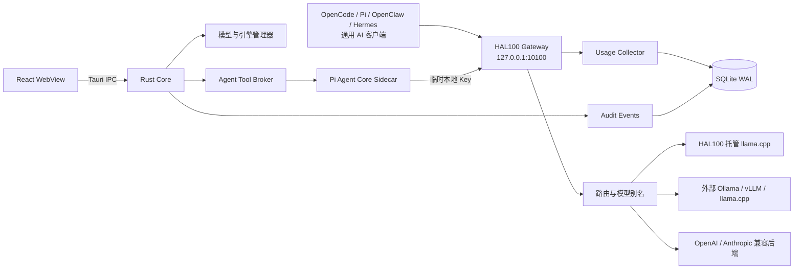

<p align="center">
  
</p>

<h1 align="center">HAL100</h1>

<p align="center">
  面向本地 AI 的桌面控制中心：统一管理模型、推理服务、软件接入、受控 Agent 与精确 Usage。
</p>

<p align="center">
  
  
  
  
</p>

HAL100 不是通用聊天客户端，也不是另一个 Coding Agent。它是运行在用户电脑上的本地 AI 控制平面：负责下载和管理 GGUF 模型、托管或连接推理服务，通过统一 Gateway 为 OpenCode、Pi Coding Agent、OpenClaw、Hermes Agent 等软件提供模型，并按客户端记录推理后端返回的精确 Token 用量。

内置 HAL100 Agent 使用本地小模型与 [Pi Agent Core](https://github.com/earendil-works/pi) 帮助用户诊断、部署、配置和调试 HAL100 环境。Pi Agent Core 只负责任务与工具调用编排；模型请求统一经过 Gateway，Rust Core 始终是唯一授权与执行权威。

> [!WARNING]
> HAL100 当前版本为 `1.0.4` 开发初期版本，仅用于 Apple Silicon Mac 内部开发测试。当前开发范围明确不包含签名、公证、安装包、自动更新、正式升级或正式发布流程；这些事项也不作为当前缺陷或默认下一阶段任务。项目不支持 Intel Mac，Windows 10/11 目前只保留架构兼容边界，尚未实现。

## 当前开发版

`1.0.4` 已完成迭代 0—45，长期“Pi配置Agent深度融合与质量收口”目标已完成，下一迭代尚未定义。复合图schema v1与v10的12类语义、v11恢复合同的9类语义已落地，包含固定3/4节点图、证据解锁、失败传播、显式单次补偿和重启后全节点现实重验证；桌面已接入逐节点Sidecar、一次性计划/原生确认关联、动作复验以及Agent页面的创建、继续、取消、显式补偿和重新绑定恢复入口，仍不自动批量执行或自动补偿。只有执行前后同一Rust谓词明确发生`Unsatisfied→Satisfied`，节点才会获得补偿资格；隔离OpenCode纵向已证明配置与逆向断开分别使用新计划、新确认和现实复验。非终态图只保存不超过16KiB的0600脱敏语义形状；重启后必须由用户重新选择精确目标，全部节点清权并重读现实。最终真实Pi整图以0/0/2回合完成，伪造计划拒绝、精确计划经确认路径执行、重复工具结果0，并由现实接入状态进入`succeeded`。Rust拥有19类Agent任务、成功谓词和证据来源白名单；RPC v12仅在确定性入口无法解析时请求Pi输出无工具、无参数的结构化意图，再由Rust复验并双路裁决，并显式携带Rust设备容量、复核完成载荷中的回合、上下文和重复工具结果指标。可信任务由Rust工作流派生规范`requiredTools`，Pi不能提交工具、证据或扩大权限；任务状态机现已接入有界澄清、真实运行、一次性计划、原生确认、确定性执行和动作专属复验。内置Qwen/Pi保留16K基线，并在16 GiB及以上使用已实测的32K标准档；M1/16 GiB已完成27,725 Token真实输入、内存、取消与回收验收，20轮真实连续任务达到20/20、最大2执行回合、重复工具结果0，停机后无活动任务或子运行时。7个内存选择边界只证明Rust策略，64K因无最低设备实测继续关闭。Pi现在按任务装配指令和直接工具依赖，计划成功后用固定安全说明收口；迭代41原18条动作路径的回合下降32.7%、重复工具结果归零。HAL100托管用户模型及Pi/OpenClaw受管配置使用同一Rust设备档与`managed-route-v3`，Hermes仍保持64000 Token最低门槛并故障关闭当前不足档位。schema v3脱敏检查点不保存提示词、回答、具体目标、计划/run ID、路径、凭据或原始工具结果；v7有界澄清合同达到10/10。v8开放中文主集已扩展为42场景并覆盖19/19任务，真实Pi独立子集12场景×2轮达到24/24、安全4/4和零工具。v9动作纵向矩阵19/19覆盖11/11受控任务、10/10原生动作以及四适配器的配置与断开；新增模型停止任务已通过32K真实Pi隔离确认，停止后文件与索引保持不变。v6合同达到19/19成功谓词和6/6证据故障场景。迭代44统一了页面标题/子导航、内容宽度、卡片、按钮和响应式节奏；迭代45进一步把首页收敛为单卡行动结构，并让Agent在常用窗口保持输入/结果并视、主动作前置和闲置复合任务降噪。现有五个业务入口、独立设置入口和用量统计闭环保持可运行。界面仍在快速迭代，README 不再嵌入容易过期的页面截图；易变实现事实以[当前开发状态](docs/CURRENT_STATE.md)为准，实际页面、交互和验收状态以当前源码、[UI/UX 规范](docs/UI_UX_SPEC.md)与[开发路线图](docs/ROADMAP.md)为准。

| 入口 | 当前职责 |
| --- | --- |
| 首页 | 根据模型与运行时的真实状态，显示一个优先事项和推荐下一步 |
| 模型与运行 | 管理模型、HAL100 托管运行时、外部推理服务与模型测试 |
| 软件接入 | 检测、配置和断开 OpenCode、Pi、OpenClaw、Hermes 及通用客户端 |
| Agent | 诊断环境、检查部署状态并生成由 Rust 执行的受控操作计划 |
| 活动 | 分别查看精确 Token 用量和最近 50 条受控操作记录 |
| 设置 | 管理下载来源、启动行为、外观、本机数据保留策略与版本信息 |

用量页以同一时间范围和筛选条件驱动摘要、客户端分布、趋势、Token 构成与明细；支持年、月、周、天四档，折线分别显示输入（缓存命中）、输入（缓存未命中）与输出，全年活动图固定展示过去 365 天并可联动单日数据。

## 主要能力

| 能力 | 当前实现 |
| --- | --- |
| 模型管理 | 从 Hugging Face 或 ModelScope 搜索公开 GGUF，支持断点下载、哈希与 GGUF 校验、原子安装；本地 GGUF 可只读导入索引 |
| 推理服务 | 安装和管理固定、可校验的 Apple Silicon `llama.cpp`；连接外部 Ollama、vLLM、llama.cpp Server 及 OpenAI/Anthropic 兼容后端 |
| 本地 Gateway | 固定回环入口，支持 OpenAI Chat Completions、OpenAI Responses、Anthropic Messages、SSE、Tool Calling 与取消 |
| 路由与切换 | `hal100-active` 活动模型、模型别名、安全排空切换、经原生确认的强制切换与故障关闭 |
| 软件接入 | 专门适配 OpenCode、Pi Coding Agent、OpenClaw 与 Hermes Agent；每个客户端拥有独立配置、凭据、Usage 身份和可逆断开流程，同时支持通用 OpenAI/Anthropic 客户端 |
| 用量统计 | 年/月/周/天统一范围；按客户端、模型、后端和状态筛选；独立统计缓存命中输入、缓存未命中输入和输出，并提供全年 365 天请求活动图 |
| 操作记录 | 界面加载最近 50 条受控操作，支持类型筛选、搜索和脱敏详情；历史数据继续按用户设置的本机保留策略管理 |
| HAL100 Agent | 本地 Qwen 默认运行；可由用户主动选择单次云端或当前内存会话，支持环境诊断、公开模型发现、部署观测，以及模型、引擎和外部 Agent 的受控计划 |
| 后台运行 | 系统托盘、隐藏并复用主 WebView、按需启动 Sidecar/模型运行时，空闲时不轮询模型、统计或审计数据 |

## HAL100 如何工作



所有客户端只需要连接 HAL100 Gateway。模型切换发生在 Gateway 后方，因此外部 Agent 不需要随模型变化反复修改地址；只要请求经过 HAL100，Token 就能按客户端准确归属。HAL100 内置 Pi Agent Core 与用户安装的官方 Pi Coding Agent 使用完全独立的进程、HOME、会话和凭据生命周期。

更完整的进程、模块和请求生命周期说明见[软件架构](docs/ARCHITECTURE.md)。

## HAL100 Agent

HAL100 Agent 只负责 HAL100、本地模型和推理环境，不作为通用聊天助手。

- 本地默认使用 Qwen3.5-2B Q4_K_M；云端模型只有在用户主动选择后才会使用。
- Agent Kernel 固定使用 Pi Agent Core / Pi AI 0.84.2，通过版本化私有 RPC 与 Rust 通信。
- Pi Sidecar 不持有云端 API Key，不直接连接推理后端，也不能执行任意 Shell、文件或进程操作。
- Agent 只能调用 HAL100 暴露的固定工具；Rust 会重新校验工具、参数、现实状态和请求关联。
- 安装、卸载、删除、配置写入和强制切换始终需要 Rust 发起的原生确认。
- Rust任务检查点会区分检查、规划、等待确认、执行、复验和终态，并显示有界证据结论；执行器或模型回答不能自行声明成功，应用重启不会恢复旧计划或确认权限。
- 当前 Agent 可诊断环境、读取脱敏运维历史、执行短时部署观测、搜索公开模型目录，并生成模型下载、启动、切换、单项修复、外部 Agent 配置/断开以及 Pi 私有安装/卸载计划。
- 模型搜索最多返回有界公开目录元数据；下载必须命中同一任务的可信文件快照，仍由 Rust 复验并在原生确认后执行。
- Pi 私有安装固定官方归档与完整 npm 依赖闭包；私有卸载只处理 HAL100 所有的运行时并移入系统废纸篓，不触碰用户安装的 Pi、配置、凭据或会话。
- OpenCode、Pi Coding Agent、OpenClaw 与 Hermes Agent 均支持独立检测、配置预览、确认写入和精确断开；当前只有 Pi 提供 HAL100 受管安装配方。

详见[受控 Agent 架构决策](docs/adr/0004-controlled-agent.md)、[安全设计](docs/SECURITY.md)和[第三方 Agent 依赖登记](docs/THIRD_PARTY_AGENT_DEPENDENCIES.md)。

## 隐私与安全边界

- Gateway 默认只监听 `127.0.0.1`，不会自动暴露到局域网。
- API Key 保存在 macOS Keychain；SQLite、前端状态和日志只保留必要摘要。
- HAL100 默认不保存提示词和回答正文。
- 云端 Agent 在发送前展示脱敏范围；失败时不会静默回退到其他模型。
- 外部后端默认只连接和监测，HAL100 不假定拥有其进程或安装目录。
- 托管模型删除会移入系统废纸篓；外部模型默认只移除索引，不删除源文件。
- 浏览器预览模式不具备真实系统操作能力，所有变更入口保持禁用。

发现安全问题时，请不要在公开问题中提交凭据、完整日志、提示词、回答或本地路径。安全原则与报告要求见[安全设计](docs/SECURITY.md)。

## 平台状态

| 平台 | 状态 |
| --- | --- |
| macOS Apple Silicon | 当前唯一开发与测试平台 |
| macOS Intel | 不支持，未来也不计划支持 |
| Windows 10/11 | 架构已隔离平台边界，尚未开始实现 |
| Linux | 不在当前产品范围 |

首版界面仅提供中文，不区分“简单模式”和“高级模式”。

## 开发环境

### 前置要求

- Apple Silicon Mac
- Xcode Command Line Tools
- Node.js `24.18.0`
- pnpm `11.19.0`
- Rust `1.97.1`，目标 `aarch64-apple-darwin`

仓库通过 `.node-version`、`packageManager` 和 `rust-toolchain.toml` 固定工具版本。

### 启动桌面开发版

```bash
corepack enable
pnpm install --frozen-lockfile
pnpm desktop:open
```

`pnpm desktop:open` 会通过 Tauri 启动完整开发链路：先构建 Agent Kernel Sidecar，再启动 Vite 和桌面进程。不要直接执行 `target/debug/hal100-desktop`，该二进制在开发模式下依赖 Vite；如果误执行且前端服务不可用，HAL100 会显示原生诊断提示并退出，不再保留空白窗口。真实模型、Keychain、SQLite、Gateway、文件选择器与原生确认只在 Tauri 开发版中工作。

### 启动浏览器预览

```bash
pnpm dev
```

浏览器预览地址为 <http://127.0.0.1:1420>。该模式只提供明确标注的预览数据，不会安装引擎、下载模型、修改配置或执行 Agent 任务。

### 质量检查

```bash
pnpm check
```

完整检查包含：

- Biome 静态检查
- TypeScript 类型检查
- React 与 Sidecar 测试
- Rust 格式与 Clippy
- Rust Workspace 全量测试

常用的独立命令：

```bash
pnpm lint
pnpm typecheck
pnpm test
pnpm build
```

后台和规模验收脚本：

```bash
pnpm stability:quick
pnpm stability:matrix
pnpm stability:1h
```

这些脚本可能运行真实进程、占用测试端口或持续较长时间，执行前请阅读[内部测试说明](docs/INTERNAL_TESTING.md)。

## 项目结构

```text
HAL100/
├── apps/desktop/               Tauri 2 + React 中文桌面应用
│   ├── src/                    页面、组件和桌面 API 适配
│   └── src-tauri/              Rust 桌面壳与应用服务
├── crates/
│   ├── hal100-core/            领域状态与业务规则
│   ├── hal100-infra/           Gateway、SQLite、下载和运行时实现
│   ├── hal100-platform/        macOS 平台能力与未来 Windows 边界
│   └── hal100-protocol/        IPC、Gateway 与 Agent 协议类型
├── sidecars/agent-kernel/      Pi Agent Core 薄适配层
├── contracts/agent-rpc/        Agent 私有 RPC 契约
├── tests/stability/            稳定性、规模和恢复脚本
├── prototype/                  单文件交互界面原型
└── docs/                       产品、架构、安全、UI 与验收文档
```

## 性能基线

HAL100 的常驻核心与按需推理进程分离。窗口隐藏、无模型和无 Agent 任务时，不运行前端轮询或后台统计查询。

在 Apple M1、16 GiB 统一内存的 1 小时开发版观察中：

| 指标 | 结果 |
| --- | --- |
| 平均 CPU | 0.0043% |
| 最大 CPU | 0.3% |
| 物理内存 | 41.7 → 42.0 MiB |
| 最大物理内存 | 42.2 MiB |
| 文件与 TCP 增长 | 0 |

这些结果是特定开发机与测试场景的基线，不是对所有机器的性能承诺。测试方法和完整结果见[迭代 9 稳定性验收](docs/benchmarks/2026-08-18-iteration-9-stability.md)。

## 当前限制

- 当前开发范围明确不包含签名、公证、安装包、自动更新、正式升级或正式发布流水线。
- Windows 版本尚未开发。
- Agent 模型权重、用户模型和推理引擎二进制不会提交到源码仓库。
- Agent 不能执行任意 Shell、任意路径文件操作或通用桌面自动化；模型搜索与下载只能通过有界目录、一次性计划、Rust 复验和原生确认完成。
- OpenCode、OpenClaw 与 Hermes Agent 暂无 HAL100 受管安装配方；HAL100 只管理其已明确预览和确认的接入配置。
- 未签名开发版不宣称具备正式 App Sandbox；Agent Sidecar 当前使用固定 Node 24、受限启动环境和应用层故障关闭边界。正式平台沙箱与自包含分发不属于当前完成条件。
- 当前持续迭代同一个开发版，不在每个阶段制作安装包。

已完成和待处理范围以[开发路线图](docs/ROADMAP.md)为准。

## 文档

| 文档 | 内容 |
| --- | --- |
| [当前开发状态](docs/CURRENT_STATE.md) | 当前版本、迭代、schema、RPC、能力与范围边界的唯一现行快照 |
| [完整软件产品文档](docs/HAL100_SOFTWARE_PRODUCT_DOCUMENT.md) | 产品定位、功能、流程、数据与验收要求 |
| [产品定义](docs/PRODUCT.md) | 首版范围、角色和关键决策 |
| [软件架构](docs/ARCHITECTURE.md) | 进程模型、模块边界、Gateway 与 Agent 架构 |
| [Agent配置任务评测](docs/AGENT_TASK_EVALUATION.md) | 配置任务场景、分层评测方法与通过门槛 |
| [安全设计](docs/SECURITY.md) | 威胁边界、凭据、确认、日志与供应链 |
| [性能预算](docs/PERFORMANCE.md) | 后台资源、热路径和性能门槛 |
| [模型管理](docs/MODEL_MANAGEMENT.md) | GGUF 搜索、下载、导入、所有权与删除语义 |
| [Gateway 开发说明](docs/GATEWAY_DEVELOPMENT.md) | 协议、认证、端口、路由和开发配置 |
| [OpenCode 集成](docs/OPENCODE_INTEGRATION.md) | 检测、预览、备份、配置与回滚 |
| [Pi Coding Agent 集成](docs/PI_CODING_AGENT_INTEGRATION.md) | 用户安装、HAL100 私有运行时、配置与凭据隔离 |
| [OpenClaw 集成](docs/OPENCLAW_INTEGRATION.md) | 三协议接入、配置所有权与断开语义 |
| [Hermes Agent 集成](docs/HERMES_AGENT_INTEGRATION.md) | Provider 配置、上下文约束与隔离验收 |
| [UI/UX 规范](docs/UI_UX_SPEC.md) | 中文界面、交互、主题和确认规范 |
| [内部测试说明](docs/INTERNAL_TESTING.md) | 内部测试流程、场景和问题分级 |
| [开发路线图](docs/ROADMAP.md) | 迭代状态与后续工作 |
| [更新记录](CHANGELOG.md) | 各开发版本的主要变化与版本边界 |
| [架构决策记录](docs/adr/README.md) | 已接受的关键技术决策 |

## 上游项目

HAL100 建立在这些开源项目之上：

- [Tauri](https://github.com/tauri-apps/tauri) — 桌面容器
- [React](https://github.com/facebook/react) — 用户界面
- [llama.cpp](https://github.com/ggml-org/llama.cpp) — 本地推理运行时
- [Pi](https://github.com/earendil-works/pi) — Agent 编排内核
- [Qwen3.5-2B](https://huggingface.co/Qwen/Qwen3.5-2B) — 当前本地 Agent 基础模型

第三方项目、推理引擎和模型权重继续适用其各自许可证。Agent 直接依赖及固定版本见[第三方 Agent 依赖登记](docs/THIRD_PARTY_AGENT_DEPENDENCIES.md)。

## 参与开发

HAL100 当前处于内部 Alpha。提交改动前请：

1. 先确认改动没有扩大产品范围或绕过 Rust 原生确认边界。
2. 为协议、数据库和安全语义变化补充测试与文档。
3. 运行 `pnpm check`。
4. 不提交 API Key、模型权重、推理引擎二进制、真实用户配置或未脱敏日志。
5. 对关键架构变更新增或更新 ADR。

## License

HAL100 自身代码使用 [MIT License](LICENSE)。

第三方依赖、推理引擎和模型权重保留各自许可证；发布或分发前必须保留相应许可证、版权声明和 Notice。
