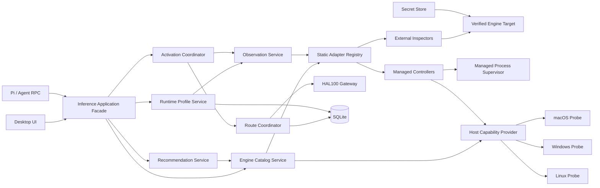
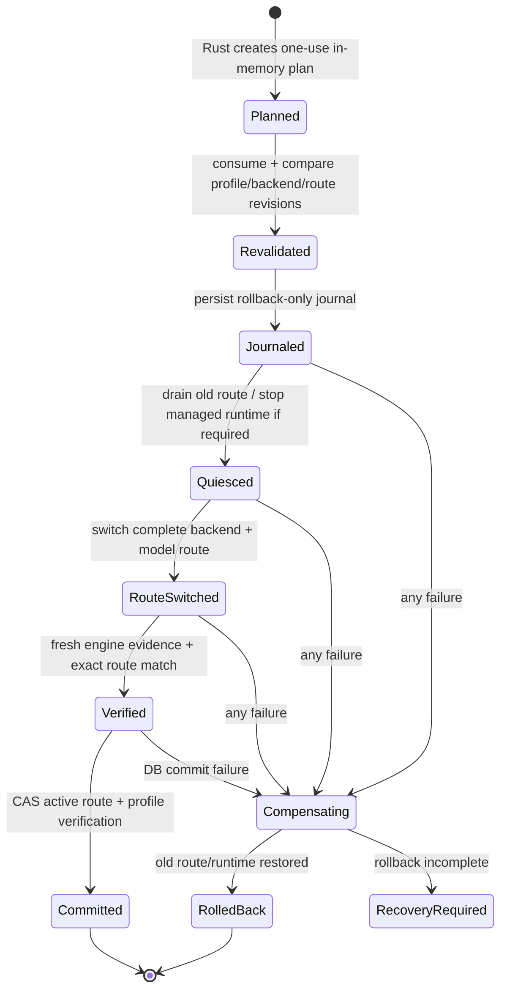

# HAL100 多推理引擎架构蓝图

- 设计日期：2026-08-27
- 适用路线：迭代51—60
- 状态：实施中的架构基线；51A—51D、平台探针基线、MLX-LM纵向与MLC LLM共同适配器软件纵向已落地，OpenVINO Model Server共同适配器纵向进行中，后续引擎继续受本文约束
- 前置决策：[ADR-0036](adr/0036-cross-platform-inference-engine-adapters.md)、
  [ADR-0039](adr/0039-external-runtime-profile-routing.md)、
  [ADR-0040](adr/0040-engine-formal-support-program.md)

本文把[推理引擎正式支持计划](INFERENCE_ENGINE_SUPPORT_PLAN.md)细化为可指导编码的模块、接口、
数据、事务、安全和测试设计。spec v3、schema v15、目标感知检查器、类型化证据与激活journal
已经实现；RPC仍为v13。本文中尚未出现在源码的应用façade、完整资格服务、推荐服务和RPC v14
仍是目标设计，具体当前事实以[当前开发状态](CURRENT_STATE.md)为准。

## 1. 启动本路线时的架构问题

### 1.1 领域概念仍有混用

`BackendKind`当前同时包含`externalOpenAi`、`externalAnthropic`等协议入口和`externalOllama`、
`externalVllm`、`externalLlamaCpp`等具体引擎。它还隐含所有权和协议。这会产生以下问题：

- 同一个vLLM实例既是“vLLM引擎”，又可能同时提供Chat、Responses、Embeddings等不同能力；
- 一个OpenAI兼容地址不一定能证明它就是某个引擎；
- 同一引擎的官方服务、社区插件和托管变体不能共享一个无版本枚举；
- UI、Gateway和运行方案容易分别推断出不同的引擎身份。

### 1.2 适配器合同只覆盖两个极端

- `InferenceEngineAdapter`拥有完整托管生命周期，但当前实际对象只有llama.cpp。
- `ExternalInferenceEngineAdapter::inspect()`没有目标参数，注册表只按`InferenceEngineKind`索引，
  适用于代码固定的单个Ollama回环实例，无法表达多个远端vLLM或同一引擎的不同变体。
- 本地发现仍对vLLM和llama.cpp Server直接探测通用`/v1/models`，这只能证明协议形状，不能证明
  具体引擎身份。

### 1.3 运行方案服务职责过重

当前`RuntimeProfileManager`同时负责：

- 数据库读取与DTO投影；
- 托管模型完整性与宿主兼容性；
- 外部引擎目录探测与候选生成；
- 方案保存、编辑、删除和重验；
- 一次性计划；
- 托管运行时启停；
- Gateway路由切换；
- 执行后复验与回滚。

继续向同一类型加入七种引擎会让错误分类、锁和测试组合快速失控。当前全局异步互斥也会让一个
慢远端探测阻塞无关方案操作。

### 1.4 数据模型仍是Ollama形状

路线启动时schema v12只允许`sha256`或`ollama_digest`，并要求外部方案具有固定64位摘要。该问题
现已由schema v15/spec v3的类型化证据解决；vLLM、SGLang、
TensorRT-LLM、OVMS、MLC LLM和LMDeploy公开的证据不同，不能安全地塞入同一个伪digest字段。
外部方案还复制完整API根地址；后续应由后端实例的配置修订和origin指纹判断变化，避免多个事实源。

### 1.5 组合根和平台实现仍面向单引擎Mac

桌面启动代码直接组装llama.cpp、Ollama注册表、BackendManager和RuntimeProfileManager；Agent先
创建一个不完整方案管理器，再通过setter替换。`NativeSystemProbe`虽然名称平台中立，实际只有
Apple Silicon实现。新架构应让桌面和Agent共享同一服务实例，并让平台实现显式注册。

## 2. 架构原则

1. **身份、协议、所有权、部署和硬件正交。** 任何一项都不能从另一项猜测。
2. **静态注册，不动态执行插件。** 新引擎由编译期Rust适配器加入，不加载第三方动态库或脚本。
3. **观察不等于授权。** 目录、健康、版本和模型信息只能形成证据；写操作仍需一次性计划和原生确认。
4. **证据强度如实表达。** 没有内容摘要时显示部署或目录身份，不虚构完整性。
5. **Gateway热路径零探测。** 所有引擎检查发生在目录、诊断、保存、计划或激活阶段。
6. **向前补偿，不恢复执行权。** 崩溃恢复只回到旧安全状态，不在重启后继续未完成的切换。
7. **按支持单元验收。** 一个引擎在Linux/CUDA通过，不代表Windows、ROCm或社区插件通过。
8. **模块化单体。** 拆职责但不引入微服务、消息总线或远程控制平面。

## 3. 目标总体结构



Desktop和Pi只依赖`InferenceApplicationFacade`的窄DTO。内部验证目标、凭据、原始证据值、路由
世代号和恢复日志都不序列化到WebView或Sidecar。

## 4. 核心领域模型

### 4.1 引擎与适配器身份

```rust
struct EngineAdapterId {
    engine: InferenceEngineKind,
    variant: EngineAdapterVariant,
    contract_revision: u16,
}

enum EngineAdapterVariant {
    LlamaCppManaged,
    OllamaHttp,
    VllmOfficial,
    VllmMetalCommunity,
    MlxLmManaged,
    MlxLmHttp,
    MlcRest,
    OpenVinoModelServer,
    SglangOfficial,
    LmDeployTurboMind,
    LmDeployPytorch,
    TensorRtLlmServe,
}
```

`InferenceEngineKind`继续表示产品层引擎家族；`variant`表示能够独立验收的实现。社区插件不能沿用
官方变体的支持结论。`contract_revision`只在适配器观察语义发生变化时递增，不追随上游版本。

### 4.2 支持单元

```rust
struct EngineSupportUnit {
    adapter_id: EngineAdapterId,
    platform: InferencePlatform,
    architecture: InferenceArchitecture,
    accelerator: InferenceAccelerator,
    deployment: InferenceDeployment,
    support_level: EngineSupportLevel,
    qualification_revision: String,
}
```

`EngineSupportLevel`使用ADR-0040确定的`Reserved / Connected / VerifiedExternal / Managed`。支持
目录只能由编译期manifest与当前宿主能力交集生成；数据库不能通过修改字符串提升支持等级。
当一次宿主交集命中多个加速器且支持等级不一致时，兼容性计算返回
`SupportCellAmbiguous`，不把最高等级传播到其他加速器。只有显式绑定具体加速器后，运行方案保存、
激活和推荐才可以解除该歧义；在绑定字段落地前，这类组合必须保持不可用。

### 4.3 引擎实例与验证目标

`EngineInstance`是用户保存的后端或HAL100托管运行时，不等同于引擎种类：

```rust
struct EngineInstance {
    id: EngineInstanceId,
    adapter_id: EngineAdapterId,
    ownership: InferenceEngineOwnership,
    deployment: InferenceDeployment,
    protocol_roots: Vec<ProtocolEndpoint>,
    credential_ref: Option<CredentialRef>,
    config_revision: u64,
    enabled: bool,
}
```

Infra根据数据库记录和SecretStore构造不可序列化的`VerifiedEngineTarget`。它包含规范origin、固定
端点策略、内部认证注入器、实例/配置修订和部署信任级别。适配器不能接受裸`String URL`。

### 4.4 观察、模型与验证锚点

```rust
struct EngineObservation {
    adapter_id: EngineAdapterId,
    instance_id: EngineInstanceId,
    config_revision: u64,
    observed_at_ms: i64,
    engine_version: Option<BoundedString>,
    service_identity: ServiceIdentity,
    health: EngineHealth,
    protocols: ProtocolCapabilitySet,
    models: Vec<ModelObservation>,
    catalog_complete: bool,
}

struct ModelObservation {
    served_model_id: BoundedString,
    display_name: BoundedString,
    evidence: VerificationEvidence,
    declared_capacity: Option<ModelCapacity>,
    formats: Vec<InferenceModelFormat>,
}
```

`VerificationAnchor`是从一次可信观察中提取并保存到运行方案的不可变比较对象：

- 适配器ID与合同修订；
- 实例ID与配置修订；
- 引擎版本或明确的`unavailable`；
- 精确服务模型ID；
- 证据类型、算法和内部值；
- 必需协议能力指纹；
- 验证时间。

观察是瞬时现实，锚点是用户确认过的历史身份。两者不能复用同一DTO。

## 5. 适配器合同

### 5.1 公共只读边界

```rust
trait EngineInspector: Send + Sync {
    fn manifest(&self) -> &'static EngineAdapterManifest;

    fn inspect<'a>(
        &'a self,
        target: &'a VerifiedEngineTarget,
        request: InspectionRequest,
        context: ProbeContext,
    ) -> InspectionFuture<'a>;

    fn qualify<'a>(
        &'a self,
        target: &'a VerifiedEngineTarget,
        request: QualificationRequest,
        context: ProbeContext,
    ) -> QualificationFuture<'a>;
}
```

- `inspect`只访问官方只读健康、版本、模型和元数据端点，不发起推理。
- `qualify`执行显式、有限、可取消的真实推理合同，只能由用户诊断/验证操作触发；目录刷新不调用。
- MLX-LM 官方服务没有只读版本端点：其 `inspect` 明确返回 `engineVersionExact=false`，仅在
  `qualify` 的模型级真实请求中读取并校验官方 `system_fingerprint` 版本前缀；该例外不会把
  推理结果当作模型内容 digest。
- `ProbeContext`固定deadline、取消令牌、响应预算、关联ID和用途枚举，不包含用户提示文本。
- 适配器返回内部观察或类型化错误，不返回任意JSON给上层。

### 5.2 托管生命周期边界

```rust
trait ManagedEngineController: EngineInspector {
    fn installation_status(&self) -> Result<ManagedEngineStatus, EngineError>;
    fn plan_provision(&self) -> Result<ProvisionPlan, EngineError>;
    fn apply_provision<'a>(&'a self, plan_id: &'a str) -> EngineOperationFuture<'a>;
    fn plan_remove(&self) -> Result<RemovalPlan, EngineError>;
    fn start<'a>(&'a self, request: ManagedStartRequest) -> EngineOperationFuture<'a>;
    fn stop<'a>(&'a self, request: ManagedStopRequest) -> EngineOperationFuture<'a>;
}
```

现有`InferenceEngineAdapter`先作为兼容façade，由新的llama.cpp控制器实现；Desktop和Agent接口
稳定后再移除旧trait。外部适配器永远不能向上转型为托管控制器。

### 5.3 静态注册表

注册表包含：

- `HashMap<EngineAdapterId, Arc<dyn EngineInspector>>`；
- 可选的`HashMap<EngineAdapterId, Arc<dyn ManagedEngineController>>`；
- `EngineSupportUnit`清单；
- manifest唯一性、所有权、variant和合同修订校验。

不使用动态库、PATH扫描、Python entry point或远端插件市场。引擎加入产品必须经过代码评审、测试
和版本化manifest。

## 6. 端点与凭据安全

### 6.1 规范origin

`ValidatedEngineOrigin`在Backend保存阶段生成：

- 禁止userinfo、query和fragment；
- 规范化scheme、host、显式端口与尾部路径；
- 本机适配器只接受`127.0.0.1`或`[::1]`，不把`localhost`DNS解析结果当作永久身份；
- 远端默认只接受HTTPS；开发期明文远端必须使用单独显式策略且不能成为默认值；
- 禁止跨origin重定向，端点路径由适配器常量拼接；
- 默认不使用系统代理，未来代理必须成为用户显式、可审计的独立配置。

### 6.2 凭据

- 数据库只存`credential_ref`；实际秘密由平台SecretStore在单次请求内读取。
- `VerifiedEngineTarget`持有认证注入器而非明文字符串；Debug、错误和观察对象不得实现秘密输出。
- 适配器manifest声明支持的认证方案；不允许把Bearer Key误发给非API origin或健康端点。
- Pi、WebView、运行方案、审计和日志都看不到凭据。

### 6.3 资源边界

每个适配器独立声明固定预算：连接/总超时、最大响应字节、最大模型数、最大字段长度和允许状态码。
共同HTTP层负责有界流式读取、取消、无重定向、无隐式重试和错误归类。GET可在明确策略下重试一次；
推理资格验证绝不自动重放非幂等请求。

## 7. 证据模型与运行方案spec v3

### 7.1 证据类型

```rust
enum VerificationEvidence {
    ContentDigest { algorithm: DigestAlgorithm, value: SecretlessBytes },
    RepositoryRevision { repository: BoundedString, revision: BoundedString },
    DeploymentFingerprint { algorithm: DigestAlgorithm, value: SecretlessBytes },
    CatalogIdentity { canonical_id: BoundedString },
}
```

这里的`SecretlessBytes`表示不是凭据，但仍只在Rust内部和SQLite使用，不进入Pi。证据种类不存在
自动强弱转换：从`CatalogIdentity`升级为`ContentDigest`需要用户显式重新绑定方案；引擎更新后
也不能静默换证据类型。

迭代60当前使用仓库内的验收证据账本 `contracts/inference-engines/v4-acceptance-evidence.json` 及其
结构合同 `contracts/inference-engines/v4-acceptance-evidence.schema.json`；v1/v2/v3文件仅保留历史可读性。
账本记录与支持单元的精确平台、架构、加速器和部署格绑定，保存 Rust 已验证的服务实例ID、origin
指纹、配置修订、协议能力哈希、版本、模型修订、主机摘要、类型化宿主证明以及脱敏来源断言；原始 API 根和凭据不进入材料。`nativeHostProbeV1`还绑定原生探针修订、精确支持格和设备类别SHA-256，指纹不包含序列号、模型目录、可用存储、端点、命令或凭据。Rust只接受有界、仓库相对的来源；正式支持注册表通过显式
`new_with_acceptance_evidence` 才能要求每个正式格具有完整记录。账本不承载运行权限；当前三条历史
外部记录显式标为`legacyHostSummaryV1`，其余25格尚未取得真机记录。

各个被忽略的 live acceptance 测试还可通过显式 opt-in 生成一次性运行产物，合同为
`contracts/inference-engines/v4-acceptance-run.schema.json`。v4运行产物不接受legacy标记，必须由
`NativeSystemProbe`生成原生宿主证明，并保存原始模型证据的类型、算法和域分离SHA-256，而不保存
模型ID或路径。运行产物和晋级账本分离，允许记录
协议/平台/生命周期等部分结果但缺少稳定性项；stdout 输出或 create-new 文件输出都必须由操作员
明确开启，禁止覆盖现有文件。只有人工审查并补齐七类证据后，才可以把结果转换为账本记录。
Rust通过 `append_run_as_formal` 完成这一转换和原子追加，重复支持格、重复记录或字段漂移会在
追加前故障关闭，且不会部分写入账本；正式记录除七类证据外还必须有三项韧性检查全部通过；运行产物中的 `model-id-sha256:*` 仅是防泄漏关联值，
必须由人工审查替换为可复核的模型修订，不能直接晋级。

运行产物中的 `stability` 是结构化聚合测量，而不是自由文本：共享探针对同一目标执行 20 次请求、
每波最多 4 个并发，并要求每次响应具有非空 choices 与正的 prompt/completion usage；记录固定
工作负载修订、p95/最大延迟、Token总量和墙钟时间。缺少稳定性
测量值、超出边界或响应失败都会使运行产物无效；该采样不授予外部服务的启动/重启权限，也不替代
取消、切换失败和重启补偿的真实纵向证据；运行产物可用 `resilience` 对象结构化记录三项控制面
检查，正式支持导入时要求三项均为 `true`，但该控制面证据仍不能替代目标引擎的真实服务验收。
v3导入不再丢弃测量对象；新正式记录必须保留它。三条早于v3的正式记录仍明确缺少数值档案，
支持报告单独计数，推荐层在无法绑定同一设备类别与工作负载时不使用这些空值。

只读支持报告schema v3只把完整的原子性能作用域投影到精确支持格：origin指纹、配置修订、引擎
版本或部署指纹、类型化模型证据指纹、原生宿主证明、`stability`测量与审阅时间必须来自同一账本
记录。任一字段缺失时整个档案为未知，不能单独暴露延迟，也不能用零值、历史断言或同引擎其他
模型/设备格填充。该报告仍只是审计事实而非执行权限。

注册表的 `new_with_reviewed_acceptance_evidence` 是账本到运行时的唯一晋级入口：它为账本中精确
匹配的支持格创建内存投影，委托原适配器完成所有网络行为，并让无记录的格继续保持
`connected`。该投影不会写回适配器 manifest、支持矩阵或数据库；审查记录与运行时状态不一致时
直接失败，防止“手工改状态但没有证据”或“证据存在却没有绑定到具体支持格”两种漂移。

对于没有稳定软件包版本端点的适配器，资格响应中的非空 `system_fingerprint` 可与模型标识绑定为
部署指纹。运行方案以显式“版本未暴露”标记保存该状态；该标记不是版本，只有部署指纹同时通过
复验时才允许保存或激活，空指纹仍故障关闭。

### 7.2 schema v13计划

在保持开发期向前迁移的前提下：

1. `backends`增加`engine_kind`、`adapter_variant`、`deployment`、`config_revision`；现有`kind`
   暂时作为线兼容字段，由确定性映射回填。
2. `runtime_profiles`增加`adapter_variant`、`adapter_contract_revision`、`backend_config_revision`、
   `evidence_kind`、`evidence_algorithm`、`evidence_value`和`protocol_contract_hash`。
3. 外部方案不再复制完整API根，改存`backend_id + backend_config_revision + origin_fingerprint`；
   origin原文只在`backends`保存。
4. llama.cpp的SHA-256与Ollama digest均迁移为`contentDigest`，保持原值和方案ID、时间戳、最近激活
   时间不变。
5. 旧`model_digest*`列在一次兼容周期内只读保留；全部读路径切换后再在后续schema删除，避免一个
   迁移同时承担数据重写和代码切换。
6. 增加非授权`runtime_activation_journal`，只记录前一/目标路由、阶段和恢复所需有界身份；不保存
   plan ID、确认权或凭据。

迁移必须有v12真实数据库夹具、非法证据故障关闭、事务中断和重复打开幂等测试。

### 7.3 schema v14：运行方案支持格绑定（已落地）

schema v14 在 `runtime_profiles` 增加可空的 `support_platform`、`support_architecture`、
`support_accelerator` 和 `support_deployment` 四列，并通过插入/更新触发器拒绝不完整或不在
协议白名单中的组合。`RuntimeProfileSupportCell` 在 spec v3 中以结构化四元组表达同一事实；
保存时必须从宿主与正式支持清单解析唯一支持格，存在多个候选时要求用户明确选择。目录复验、
激活计划与授权 CAS 均绑定该四元组，支持格缺失、漂移或与宿主/清单不匹配时故障关闭。旧 v3
方案保持可读但因缺少支持格进入 `NeedsRepair`，不会静默推断加速器授权。

### 7.4 schema v15：设备语义去混淆（已落地）

schema v15从`InferenceAccelerator`和新持久化约束中移除把引擎品牌当设备的`openvino`值，增加
`intel_gpu`与`intel_npu`。OVMS按CPU、Intel GPU、Intel NPU拆成三个精确适配器变体，每个变体在
同一平台/架构/部署坐标下只声明一种加速器。迁移不会猜测旧`openvino`究竟代表GPU还是NPU：旧
支持格四元组被整体清空、旧`ovms-openai-server`后端解除引擎绑定并增加配置修订，随后由用户在
桌面重新选择精确变体并完成实时复验。该迁移只处理开发期本地数据合同，不引入安装包、自动更新
或正式升级流程。

## 8. 应用服务拆分

保留`RuntimeProfileManager`作为第一阶段兼容façade，内部逐步委托：

| 服务 | 唯一职责 |
| --- | --- |
| `EngineInstanceRepository` | 读取/保存后端实例、配置修订和凭据引用 |
| `EngineObservationService` | 构造验证目标、调用适配器、single-flight与内存缓存 |
| `EngineCatalogService` | 合并静态支持单元、宿主能力、实例和脱敏观察 |
| `RuntimeProfileRepository` | spec v3读写、迁移和唯一性约束 |
| `RuntimeProfileService` | 候选、保存、编辑、删除、重验和DTO投影 |
| `ActivationPlanner` | 读取新鲜现实、生成一次性计划并绑定所有修订 |
| `ActivationCoordinator` | 消费计划、状态机、路由、托管运行时、复验和补偿 |
| `RouteCoordinator` | 独占Gateway内存路由、SQLite活动路由、世代号和恢复日志 |
| `EngineQualificationService` | 显式真实推理资格验证与协议能力报告 |
| `EngineRecommendationService` | Rust确定性筛选和排序，不执行切换 |

Desktop启动组合根一次性创建这些服务，并把同一个`InferenceApplicationFacade`注入Tauri命令与
Agent；删除Agent构造后再setter替换方案管理器的双重组装。

## 9. 观察缓存与并发

### 9.1 两类读取

- **展示读取**允许使用带`observed_at`和`freshness`的短时内存缓存，按实例+配置修订single-flight，
  避免同一页面为多个方案重复探测。
- **授权读取**用于保存、重验、计划、激活和最终谓词，必须绕过陈旧缓存或要求观察时间晚于本次
  操作开始；不能用UI缓存签发计划。

迭代51先测量后确定TTL。建议初始展示TTL为本机5秒、远端15秒，最多并发4个实例；这些数值在
没有基准前不写入稳定产品合同。

### 9.2 锁顺序

避免在全局锁内等待远端HTTP：

1. 无锁读取profile/backend修订并做首次新鲜观察；
2. 获取目标profile锁；
3. 激活时再获取全局route锁；
4. 按`instance_id`排序获取必要的实例锁；
5. 比较CAS修订并执行短时最终复检；
6. 进入状态机。

禁止反向获取。保存不同引擎实例的方案可并发；活动路由切换仍全局串行。

## 10. 激活与恢复状态机



计划必须绑定：profile ID/修订、adapter ID/合同、instance ID/配置修订、验证锚点、当前活动路由
世代和是否需要停止托管运行时。确认后仍全部重验。

### 10.1 崩溃规则

- `Planned`只存在内存，重启即失效。
- 存在未完成journal时，启动恢复只能尝试旧路由/旧托管状态或标记`RecoveryRequired`；绝不继续
  切换到目标引擎。
- journal完成后与活动路由在同一SQLite事务提交；清理journal可幂等重试。
- Gateway启动只加载已提交活动路由，不读取未确认目标。

## 11. Gateway协议能力

`OpenAI compatible`拆成版本化`ProtocolCapabilitySet`：

- `ModelsList`
- `ChatCompletionsUnary` / `ChatCompletionsStream`
- `Completions`
- `ResponsesUnary` / `ResponsesStream`
- `Embeddings`
- `UsagePromptCompletion` / `UsageCachedTokens`
- `ToolCallsSingle` / `ToolCallsParallel`
- `StructuredOutput`
- `VisionInput` / `AudioInput`
- `RequestCancellation`

适配器manifest声明理论能力，真实qualification生成已验收子集。Gateway创建路由时固定合同快照，
请求热路径只查内存位集，不访问引擎元数据。HAL100 Agent至少要求Chat、流式、Usage和已验收的
工具能力；不满足时只能作为普通用户模型后端，不能自动成为Agent模型。

## 12. 三平台宿主架构

### 12.1 平台接口

```rust
trait HostCapabilityProvider {
    fn snapshot(&self, model_storage: &Path) -> Result<HostCapabilitySnapshot, HostProbeError>;
}
```

实现拆为`MacOsHostProbe`、`WindowsHostProbe`和`LinuxHostProbe`，由`cfg`组合根注册。共享层只消费
协议类型，不包含`sysctl`、PowerShell或Linux命令字符串。

### 12.2 能力来源

- macOS：现有sysctl/存储探测，加速器只声明已验证Metal/CPU。
- Windows：原生系统API读取内存、CPU、架构和卷空间；GPU优先DXGI/厂商受控API，不解析命令输出。
- Linux：`sysinfo/statvfs`或等价Rust/系统API读取基础能力；GPU通过受控DRM/sysfs与官方运行时
  API交叉确认，不以`CUDA_VISIBLE_DEVICES`等环境变量作为硬件证据。
- CUDA、ROCm、XPU、NPU支持由“硬件存在 + 适配器运行时qualification”共同成立。

三平台源码构建可以先通过；某加速器没有真机证据时对应支持单元继续故障关闭。

## 13. 托管运行时与进程监督

MLX-LM等缺少强外部服务身份的引擎可能需要HAL100托管变体。托管能力拆为：

- `EngineArtifactManifest`：上游版本、平台资产、依赖锁、哈希、许可证和适配器修订；
- `EngineProvisioner`：一次性安装/移除计划，只写产品私有引擎目录；
- `ManagedProcessSupervisor`：固定可执行文件、工作目录、环境白名单、回环监听、超时和退出回收；
- `ManagedRuntimeState`：精确PID身份、启动配置摘要、模型身份、端口租约和崩溃结果；
- `EngineCapacityPolicy`：由宿主能力和真机基准选择上下文/批处理，不接受模型文本覆盖。

Python引擎不能复用用户全局Python或任意venv。若要托管，必须有HAL100私有、版本化依赖闭包；
这属于引擎运行时配置，不等于制作HAL100安装包。外部变体仍不获得这些权限。

## 14. Desktop信息架构

### 14.1 引擎与实例

“模型与运行”中的推理服务页分三层：

1. **正式支持矩阵**：引擎、变体、平台/加速器、支持等级和当前宿主兼容性；
2. **已配置实例**：地址/部署位置、认证状态、实时健康、版本和协议能力；
3. **运行方案**：模型、证据等级、容量、最后验证、漂移和最近激活。

用户流程固定为：

```text
保存实例 → 只读检查 → 可选真实资格验证 → 选择模型 → 保存运行方案 → 原生确认激活
```

`reserved`引擎只有解释和路线状态，不显示可操作的“启用”按钮。`connected`实例可用于普通路由，
但不能保存成声称引擎已验证的方案。

### 14.2 错误表达

现实状态漂移继续由`RuntimeProfileIssue`表达，例如后端身份、引擎版本、模型完整性和支持格变化；
操作失败统一使用`RuntimeProfileFailure`，固定包含：

- `code`：引擎中立的稳定失败码，区分服务不可达、响应无效、适配器不可用、资格失败、验收证据
  缺失、设备未证明、计划失效、激活失败和恢复必需等情况；
- `stage`：输入、持久化、发现、检查、资格、证据、复验、计划、激活、恢复或原生交互；
- `retryable`：当前状态下是否允许重新计划，而不是由UI或Pi猜测；
- `recoveryAction`：修正输入、启动运行时、检查服务、审查/复验方案、选择支持格、重试、恢复激活
  或更新应用。

Infra运行方案管理器是内部错误到该合同的唯一映射权威。Desktop与Pi只消费安全code和恢复语义，
不接收端点、模型身份、上游响应、命令、凭据或底层错误正文；UI根据恢复动作分组，而不是把全部
错误显示成“需要修复”。

## 15. Pi / Agent契合方式

### 15.1 RPC投影

首次新引擎正式开放时再升级RPC v14，增加：

- `supportLevel`
- `adapterVariant`
- `platformCompatibility`
- `evidenceKind`（不含值）
- `protocolCapabilities`
- `capacitySource`
- `qualificationStatus`

仍不包含API根、证据值、凭据、命令、路径、内部路由世代或恢复journal。

### 15.2 确定性推荐

`EngineRecommendationService`先由Rust筛选：

1. 正式支持且当前宿主兼容；
2. 实例已启用且现实可达；
3. 运行方案证据有效；
4. 满足任务所需协议能力；
5. 上下文/输出容量满足；
6. 用户偏好和已验证性能档案排序。

Pi只接收最多三个脱敏候选及Rust给出的枚举化理由，用于中文解释。Pi不能新增候选、改变评分、
猜测容量或触发静默回退。多引擎目录通过结构化工具按需读取，不把完整矩阵永久塞入系统提示，
避免浪费已有16K/32K上下文。

## 16. 观测、性能与隐私

### 16.1 只记录有界指标

- 适配器/变体、支持单元、探测用途；
- 成功/错误类别、耗时、响应大小档位、模型计数；
- qualification能力结果；
- 激活阶段、补偿结果、漂移类型；
- Gateway按能力合同的请求结果与后端精确Usage。

不记录原始URL、凭据、模型路径、证据值、请求/回答或完整外部响应。模型ID只在现有必要用量事实
中保存，不复制到调试指标。

### 16.2 性能约束

- Gateway请求热路径不做引擎探测、数据库迁移或能力计算。
- 目录按实例single-flight，同一观察投影到多个方案。
- 大模型目录流式有界解析；任何引擎不得无限收集JSON。
- 页面关闭或任务取消要传播到探测future。
- 多实例目录刷新需有并发上限和整体deadline，单个慢服务不阻塞其他卡片展示。

## 17. 测试架构

### 17.1 七层测试金字塔

1. **纯领域测试**：支持单元交集、证据比较、能力集合、错误映射和推荐排序。
2. **适配器合同测试**：每个适配器复用同一套成功、超时、超大、伪身份、重定向、目录不完整、
   重复模型和字段边界用例。
3. **数据库迁移测试**：v12→v13、重复打开、非法数据、事务中断、journal恢复。
4. **组件测试**：伪HTTP服务 + SecretStore + Backend + Profile + Gateway完整纵向。
5. **官方服务测试**：固定上游版本/镜像/模型修订，验证实际端点和协议，不使用`latest`作为证据。
6. **真机矩阵**：macOS/Metal、Windows CPU/Vulkan/Intel、Linux CUDA/ROCm/XPU等逐格报告。
7. **产品回归**：Desktop视觉/键盘/错误恢复、Agent脱敏工具、崩溃/取消、长时稳定性。

### 17.2 每个引擎的共同纵向

```text
注册manifest
→ 保存实例
→ 只读观察
→ 资格验证
→ 保存方案
→ 漂移检测
→ 生成一次性计划
→ 激活
→ Gateway真实请求
→ 最终现实复验
→ 故障注入与回滚
```

任何缺失步骤都不能通过“通用后端请求成功”替代。

## 18. 推荐代码布局

在不一次性移动Gateway/Database大文件的前提下新增目录，并以`mod.rs`重新导出兼容名称：

```text
crates/hal100-protocol/src/inference/
  identity.rs          # engine/adapter/support unit
  capabilities.rs      # protocol + host compatibility
  evidence.rs          # observations and anchors
  profiles.rs          # spec v3 DTO

crates/hal100-infra/src/inference/
  registry.rs
  target.rs
  observation.rs
  catalog.rs
  profiles.rs
  activation.rs
  route_coordinator.rs
  qualification.rs
  recommendation.rs
  adapters/
    ollama.rs
    vllm.rs
    mlx_lm.rs
    mlc.rs
    ovms.rs
    sglang.rs
    lmdeploy.rs
    tensorrt_llm.rs

crates/hal100-platform/src/probe/
  macos.rs
  windows.rs
  linux.rs
```

现有公共类型先从旧模块`pub use`，避免Desktop、Agent和测试在同一提交中大面积迁移。

## 19. 迭代级迁移顺序

### 迭代51A：无行为重构

- 建立新目录、`EngineAdapterId`、支持等级和manifest。
- 让llama.cpp/Ollama通过新注册表投影现有DTO，行为与schema不变。
- 组合根直接注入同一方案服务，删除Agent setter替换。

门槛：现有352项默认Rust测试、Desktop/Kernel测试和Ollama纵向完全不变。

### 迭代51B：目标与观察服务

- 引入`EngineInstance`、`ValidatedEngineOrigin`、`VerifiedEngineTarget`和共同HTTP边界。
- Ollama改用目标感知接口但仍只接受固定回环策略。
- 加入展示缓存和授权新鲜读取分离。

门槛：现有Ollama安全限制不放宽；多实例伪适配器证明不会按engine kind错误复用快照。

### 迭代51C：spec v3/schema v13

- 实施证据类型、后端配置修订、origin指纹和双阶段兼容迁移。
- 拆出Repository、ProfileService、Planner、Coordinator与RouteCoordinator。
- 引入rollback-only journal和崩溃恢复测试。

门槛：v12真实夹具无损迁移；llama.cpp/Ollama方案ID、证据和最近激活时间保持；重启只回滚不前进。

### 迭代51D：vLLM合同试桩

- 只实现伪服务vLLM manifest、版本/健康/模型端点解析和协议能力夹具。
- 不在UI标记正式支持，不启用真实运行方案。

门槛：第二种引擎证明架构可复用，没有向Ollama代码增加`if vllm`组合分支。

### 迭代52及以后

按[正式支持计划](INFERENCE_ENGINE_SUPPORT_PLAN.md)逐个落地平台和引擎。每个引擎只新增自己的
适配器、manifest和资格夹具；Profile、Activation、Gateway、Desktop与Agent只消费共同合同。

截至迭代54，MLX-LM 已完成 Apple Silicon/Metal 回环支持单元；迭代55已接入 MLC LLM 官方
OpenAI 回环协议和共同资格夹具，迭代60又按Metal/Vulkan/CUDA/ROCm拆成四个单设备变体；官方无稳定包版本端点，非空`system_fingerprint`可绑定
部署指纹，但编译产物身份与真机验收完成前仍保持`connected`。迭代56已接入 OpenVINO Model Server（OVMS）官方KServe元数据/健康、OpenAI
模型目录与共同协议资格适配器，并将CPU、Intel GPU、Intel NPU拆为三个单设备变体；六个
Windows/Linux x86_64支持单元在Intel真机证据
完成前保持`connected`。迭代57已加入SGLang官方OpenAI服务的版本/健康/目录/协议共同适配器，
Linux x86_64/CUDA真机证据完成前同样保持`connected`。迭代58已加入LMDeploy官方`api_server`
的健康/目录/协议共同适配器；Linux/Windows x86_64/CUDA真机以及版本/TurboMind/PyTorch身份
证据完成前保持`connected`。迭代59已加入TensorRT-LLM官方`trtllm-serve`的版本/健康/目录/协议
共同适配器；Linux x86_64/aarch64/CUDA真机、GPU能力、HF checkpoint或TensorRT engine形态、
backend/并行配置和运行方案证据完成前保持`connected`，其余支持单元继续按本清单逐格推进。

迭代60进一步把运行方案失败收敛为Protocol拥有的跨引擎合同：每个错误只投影固定code、发生阶段、
可重试性和建议恢复动作。Infra是数据库、托管引擎、外部适配器、资格、证据、支持格及激活错误的
唯一映射权威；Desktop与Pi不得再从错误正文、端点或引擎名称推断处理方式。

## 20. 架构验收清单

开始迭代53首个正式新引擎前，必须全部满足（现已作为共同合同落地；未取得真机证据的支持单元
仍保持不可用）：

- [x] 具体引擎身份不再由`BackendKind`或端口推断；
- [x] 同一引擎多个实例和多个adapter variant不会互相复用观察；
- [x] 运行方案能保存非digest证据且UI不夸大完整性；
- [x] 探测目标只能来自已保存实例，Pi/WebView不能提交URL；
- [x] 展示缓存永远不能授权保存或激活；
- [x] 激活计划绑定profile、instance、adapter、evidence和route全部修订；
- [x] 崩溃journal只允许回滚，不允许恢复执行权；
- [x] Gateway热路径没有HTTP探测或SQLite写入；
- [x] Desktop与Agent共享同一Application Facade；
- [x] Windows/Linux未验证能力保持不可用；
- [x] Ollama与llama.cpp现有闭环、错误和性能没有回退；
- [ ] 文档、迁移、合同、真机和故障注入证据齐全。

前11项已有类型化协议、运行方案事务、注册表隔离、Pi受控计划和非ignored回归作为当前证据；最后
一项必须等25个待验收支持格取得原生主机和真实服务记录后才能勾选，结构夹具或源码CI不能替代。
